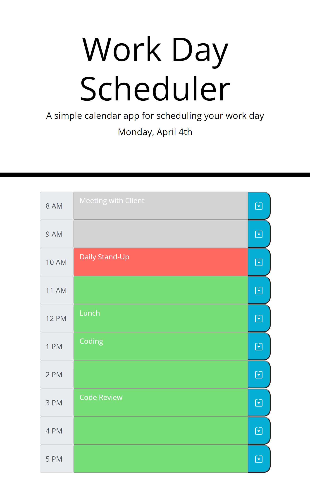

# Work Day Scheduler

## Description

For this project, I created a Work Day Scheduler page based on the below user story and acceptance criteria.

### User Story

>

### Acceptance Criteria

>

## Purpose

The purpose of this project is to build a work day scheduler using all the knowledge I gained during bootcamp. This project really tested my skills in Javascript and usage of third-party APIs.

## Result

The below picture is the final result. Screenshot was taken at 10:12 AM

>The Work Day Scheduler displays the current date on the top. You are able to enter tasks into each timeblock text area and save to local storage. When the page refreshes, the saved text will remain.
>
>For each time block:
>- When the time is in the past, timeblocks will be gray
>- When the time is current, timeblock will be red
>- When the time is in the future, timeblocks will be green
>
>)

## Languages Used

- HTML
- CSS
- JavaScript

## Libraries Used

- JQuery
- Bootstrap
- Moment.js
- Font Awesome
- Google Fonts

## Link To Deployed Page

- [Work Day Scheduler](https://james-y-wong.github.io/hw-5-work-day-scheduler/)